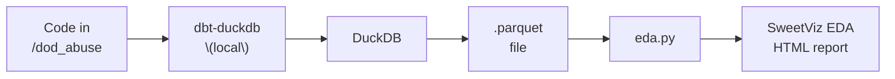
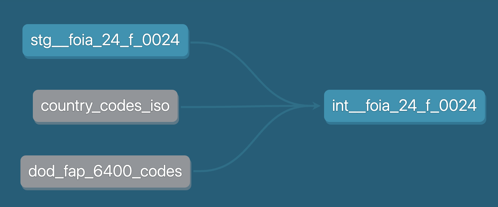

# Data Liberation Project: DOD Child and Domestic Abuse Incidents

Yep, this is a terrible topic.  But the work in this repo is going to help journalists dig into this topic and drive (proper) transparency around this

Docs page: https://www.data-liberation-project.org/requests/dod-child-and-domestic-abuse-incidents/

## Overall flow



## dbt Notes

The folder [dod_abuse](dod_abuse) is a "dbt" project, meant to be run locally with DuckDB (see instructions in section below)

File types & folders:
- CSV mapping "seed" files are in the [dod_abuse/seeds](dod_abuse/seeds) folder (lineage color: gray)
- SQL files are in the [dod_abuse/models](dod_abuse/models) folder (lineage color: gray)



## How to run locally

1. Install uv: https://docs.astral.sh/uv/getting-started/installation/
1. Download the Excel file: [DoD Abuse Google Drive Folder "Data" > 24-F-0024_FY16-FY23_Final.xlsx](https://docs.google.com/spreadsheets/d/1T1ZSuCQwAjlQfR51AraEeCR2P4fEs53V/edit?usp=drive_link&ouid=117324603614392259343&rtpof=true&sd=true)
    1. Copy+Paste the local path into [dod_abuse/models/stg__foia_24_f_0024.sql](dod_abuse/models/stg__foia_24_f_0024.sql) --> read_xlsx()

1. Open in DuckDB locally

    ```bash
    cd $(git rev-parse --show-toplevel)/dod-abuse/dod_abuse
    uv run python
    >>> import duckdb
    >>> duckdb.sql("attach 'dev.duckdb'")
    >>> duckdb.sql("CALL start_ui()")
    ```
